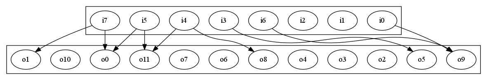
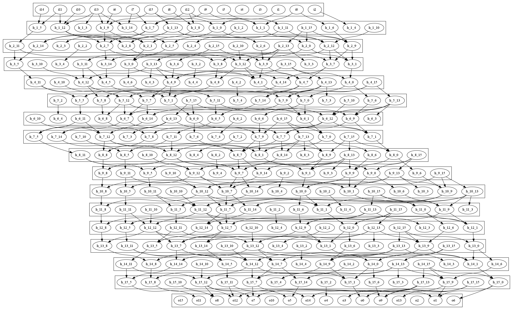

Overview
========

This is due at:

    22:00, 10th Nov 2017

This exercise looks at less regular types of computation,
and looks at situations where you might have to re-organise
the code in order to make it faster. 

The overall application domain is a very simple
[multi-layer perceptron network](https://en.wikipedia.org/wiki/Multilayer_perceptron).
We only look at the feed-forward part, i.e.
classification part. At each layer a vector of data is
presented, and the layer transforms it into a new vector of
data. The output of one layer goes into the input of
the next layer, and so on.

Exploring the application
=========================

The purposes of this course is to accelerate and optimise
things even if you don't fully understand them, so don't
worry if you've never looked at neural networks. It is
better to look at the code. So first build all the
tools:

    make tools

This should leave you with a number of programs in the
`bin` directory:

    - `bin/run_network` : This takes a list of layers (encoded
        as binary files) then runs data through them.
    
    - `bin/generate_sparse_layer` : This creates an instance of
        a layer with a given input and output size, and writes
        it to stdout as a binary file.
        
    - `bin/print_layer_as_text` : Takes a binary layer description
        and prints it as human readable text.
        
    - `bin/print_network_as_dot` : Takes a list of layers (binary
       descriptions) and prints them in the [GraphViz/dot](http://www.graphviz.org/) format.

In order to get a feel for this, create a layer with
8 inputs and 12 outputs:

    bin/generate_sparse_layer 8 12 > w/layer_8_12.bin

This should have generated a file called `w/layer_8_12.bin`,
in the directory called `w`. This directory has a `.gitignore`
that stops things getting accidentally added, so feel free to
dump anything in there.

You can view the layer as text:

    bin/print_layer_as_text < w/layer_8_12.bin

You should see some information about the nework, and
in particular the list of synapses, or weights. There
will be many lines looking like this:

       98 : 10 <- 6 (0.660889)

this gives the connectivity of the graph. In this case
it is saying that synapse `98` takes input `6` and transfers
it to output `10` with weight `0.660889`. This particular
layer is _sparse_, which means that even though there are
8*12=96 possible paths, only 9 of them exist, so the layer
has a sparsity factor of 0.09375. Sparsity is often useful
for reducing compute load, but the resulting irregularity
makes it more difficult to optimise.

_Optional_: We can also view the network as a graph if
[GraphViz](http://www.graphviz.org/) is installed. First
generate a dot file from the graph:

    bin/print_network_as_dot w/layer_8_12.bin > w/layer_8_12.dot

then render it as a png:

    dot w/layer_8_12.dot -Tpng > w/layer_8_12.png

This results in the following image on my machine:

In this instance it is so sparse that some neurons aren't connected,
but others have multiple connections.

A layer is applied to data by turning it into an instance
of the `Layer` class, found in [`include/layer.hpp`](include/layer.hpp).
Each instance of `Layer` contains the set of connections for
one layer, and is able to execute that layer through `Layer::execute`.
The reference version of `Layer::execute` is given by the
class `SimpleLayer`, which is in
[`src/layers/simple_layer.hpp`](src/layers/simple_layer.hpp).

Looking in `SimpleLayer::execute`, the key code is:

    void execute(
        const int8_t *pIn,  // Values of input neurons in -127..+127
        int8_t *pOut        // Values of output neurons in -127..+127
    ) const
    {        
        // Create a working vector of nOut values
        std::vector<int32_t> acc(m_nOut, 0); 
        
        // Loop over all synapses (edges)
        for(unsigned i=0; i<m_synapses.size(); i++){
            int32_t contrib = m_synapses[i].weight * pIn[ m_synapses[i].src];
            acc[ m_synapses[i].dst ] += contrib >> (23-16);
        }
        
        // Transform all outputs
        for(unsigned i=0; i<m_nOut; i++){
            pOut[i] = sigmoid( acc[i] ); // compress with sigmoid function
        }
    }

There are two loops in here:

- Iterate over the synapses to transfer contributions from the input
   layer to the output layer.
   
- Compress the accumulated input values to a value between 0 and 1 using
  a sigmoid function, in this case `sigmoid(x) = 1/(1+exp(-x))`.
  
This example uses fixed-point rather than floating-point, as it
makes it easier to check whether we are getting the right results.
If we used floating-point then the order of execution matters,
but with fixed-point it should always be the same.

To run the application, generate 1024 bytes of random input data
(updated as [suggested](https://github.com/HPCE/hpce-2016-cw4/issues/1) by @
awai54st) :

    cat /dev/urandom | head -c 1024 > w/random1024.bin

You can then run the filter as a single layer network:

    cat w/random1024.bin | bin/run_network w/layer_8_12.bin > w/ref1024.bin

You'll have ended up with a 1536-byte output file, because the output
layer is larger than the input size. Internally `bin/run_network` will cut
the data up into batches that match the size of the data.
    
Parallelising with Pipes
========================

The idea is to have multiple layers, not just one layer, and this
presents a performance bottleneck. Generate 8 layers, each of
size 16x16:

    for i in $(seq -w 0 16); do
        mkdir -p w
        bin/generate_sparse_layer 16 16 > w/n16_${i}.bin;
    done

You should have ended up with 16 files, which can then be used
as a network:

    cat w/random1024.bin | bin/run_network \
        w/n16_00.bin w/n16_01.bin w/n16_02.bin w/n16_03.bin \
        w/n16_04.bin w/n16_05.bin w/n16_06.bin w/n16_07.bin \
        w/n16_08.bin w/n16_09.bin w/n16_10.bin w/n16_11.bin \
        w/n16_12.bin w/n16_13.bin w/n16_14.bin w/n16_15.bin \
        > w/ref_n16_1024.bin

This will have run the same data through a 16 layer network,
rather than just 1.

_Optional_: We can generate a dot graph of this network:

    bin/print_network_as_dot \
        w/n16_00.bin w/n16_01.bin w/n16_02.bin w/n16_03.bin \
        w/n16_04.bin w/n16_05.bin w/n16_06.bin w/n16_07.bin \
        w/n16_08.bin w/n16_09.bin w/n16_10.bin w/n16_11.bin \
        w/n16_12.bin w/n16_13.bin w/n16_14.bin w/n16_15.bin \
        > w/n16.dot

then render it to a png:

    dot w/n16.dot -Tpng > w/n16.png

I get this mess:

The overall computational goal is to make the networks deeper and wider,
so in general we want more layers, and each layer should be bigger.

*Task*: Create a script called `scripts/create_n512.sh` with
the following contents:

    #!/bin/bash
    for i in $(seq -w 0 32); do
        mkdir -p w
        bin/generate_sparse_layer 512 512 > w/n512_${i}.bin;
    done
    
If you run this script it should generate 32 layers, each of
which are 512 wide.

*Task*: Create a script called `scripts/run_n512_P1.sh` with the following
contents:

    #!/bin/bash
    bin/run_network \
        w/n512_00.bin w/n512_01.bin w/n512_02.bin w/n512_03.bin \
        w/n512_04.bin w/n512_05.bin w/n512_06.bin w/n512_07.bin \
        w/n512_08.bin w/n512_09.bin w/n512_10.bin w/n512_11.bin \
        w/n512_12.bin w/n512_13.bin w/n512_14.bin w/n512_15.bin \
        w/n512_16.bin w/n512_17.bin w/n512_18.bin w/n512_19.bin \
        w/n512_20.bin w/n512_21.bin w/n512_22.bin w/n512_23.bin \
        w/n512_24.bin w/n512_25.bin w/n512_26.bin w/n512_27.bin \
        w/n512_28.bin w/n512_29.bin w/n512_30.bin w/n512_31.bin

Note that this script provides no input and no output for `bin/run_network`,
so it will come from the input and output of the script. To run it, generate
a bigger chunk of input data:

    cat /dev/urandom | head -c 1048576 > w/random1M.bin

and then pipe it through:

    cat w/random1M.bin | scripts/run_n512_P1.sh > /dev/null

Depending on your system, this might take a while (up to minutes).
To get a sense of what is going on, it can be useful to use the
tool [pv](https://linux.die.net/man/1/pv), which displays progress
of data through the stream:

    cat w/random1M.bin | scripts/run_n512_P1.sh | pv > /dev/null
    
This shows you the bandwidth of the data flowing out of the
pipeline, as well as total data that has passed through. We
could alternatively have placed `pv` at the beginning:

    cat w/random1M.bin | pv | scripts/run_n512_P1.sh > /dev/null
    
which for the P1 version will make little difference.

*Task*: Create a script called `scripts/run_n512_P2.sh` with the following
contents:

    #!/bin/bash
    bin/run_network \
        w/n512_00.bin w/n512_01.bin w/n512_02.bin w/n512_03.bin \
        w/n512_04.bin w/n512_05.bin w/n512_06.bin w/n512_07.bin \
        w/n512_08.bin w/n512_09.bin w/n512_10.bin w/n512_11.bin \
        w/n512_12.bin w/n512_13.bin w/n512_14.bin w/n512_15.bin \
    | bin/run_network \
        w/n512_16.bin w/n512_17.bin w/n512_18.bin w/n512_19.bin \
        w/n512_20.bin w/n512_21.bin w/n512_22.bin w/n512_23.bin \
        w/n512_24.bin w/n512_25.bin w/n512_26.bin w/n512_27.bin \
        w/n512_28.bin w/n512_29.bin w/n512_30.bin w/n512_31.bin
        
Be careful about the line endings - each of the `\` characters at the
end of the line means that the command continues, and the pipe `|` character
is joining them together.

Run your new pipeline, and see if the performance is any different:

    cat w/random1M.bin | scripts/run_n512_P2.sh | pv > /dev/null
    
You can also look at the result with `time` to see what is going on,
and also may want to look at your task manager (e.g. `top` or `htop`).
    
*Task*: Create a script called `scripts/run_n512_P4.sh`, which splits
the network into four stages.

*Task*: Create a script called `scripts/run_n512_P8.sh`, which splits
the network into eight stages.

*Task*: Create a script called `scripts/run_n512_P16.sh`, which splits
the network into sixteen stages.

*Task*: Create a script called `scripts/run_n512_P32.sh`, which splits
the network into 32 stages.

Hopefully you'll see different results, and depending on your number
of cores, you should see pretty decent speed-ups. Note that it
depends on the amount of data flowing through - if there is not
enough data, then eventually the speed-up will reduce.

*Task*: Generate a plot of P (i.e. which script was used) versus
_sustained_ bandwidth (i.e. bytes/sec) for these scripts on a `c4.8xlarge`
AWS instance. Note that you may want to leave this till all of
your development work is done, so that you don't keep starting
and stopping instances. Save the plot as `results/pipeline_p_vs_bandwidth.pdf`.

The takeaway lesson from this should be that pipelines can be
quite effective at doing load-balancing and parallelising
sequential components. It is often easier to split a task
up into parallel stages, rather than trying to parallelise
an individual stage. It's also possible to put things like
decompressors and compressors on the front and end of the
pipeline, reducing the size of the data on disk.

Parallelising with TBB
======================

While pipeline parallelism in the shell can work well,
there is a lot of overhead due to moving data between
processes, so it is still worthwhile exploring how
to make an irregular application faster using our
current methods. At the moment we've only looked at
simple dense iteration spaces, so some extra thought
will be needed for this application.

Look at the existing implementation of `SimpleLayer::execute`,
and consider the two loops:

- Is there any data-sharing between iterations?

- Do any iterations _write_ to the same locations?

- Can they be parallelised?

(This is another "in your head" thing, you don't need to
write it down).

*Task*: create a new layer engine called `par_for_naive` which
parallelises both loops _without_ regard to correctness:

- copy the implementation `src/layers/simple_layer.cpp` into a new
   file called `src/layers/par_for_naive_layer.cpp`.

- Change the class name from `SimpleLayer` to `ParForNaiveLayer`

- Adjust the factory function at the bottom of the file (i.e.
  `CreateSimpleLayer` -> `CreateParForNaiveLayer`).

- Go into `src/layers/layer_factory.cpp`, and make sure the new
  engine is created if the engine type is "par_for_naive".
  
- Parallelise the two loops.

Once you have got this setup, you should be able to do:

    cat w/random1024.bin | \
       bin/run_network w/n512_00.bin:par_for_naive \
       > w/random1024_par_for_naive.out

in order to select the new engine (note the `:par_for_naive` suffix
on the layer), or:

    cat w/random1024.bin | \
       bin/run_network w/n512_00.bin:simple \
       > w/random1024_simple.out
       
to select the original (default) engine.

The [`diff`](https://linux.die.net/man/1/diff) command can be used to tell if two files are
different. Use it to convince yourself that `w/random1024_par_for_naive.out`
and `w/random1024_simple.out` are different (or at least
that _sometimes_ they are different).

Parallelising Using Atomics
===========================

There is a clear problem in the first for loop, where multiple
tasks are writing to the `acc` array at the same time. One
solution is to make the accesses [`atomic`](https://software.intel.com/en-us/node/506277).
Fortunately we are dealing with integer data, rather than floating-point,
so you can just replace:

    std::vector<int32_t> acc(m_nOut, 0);
    
with:

    std::vector<tbb::atomic<int32_t> > acc(m_nOut, 0);

*Task*: create a new implementation called `ParForAtomic`
with engine name `par_for_atomic`, and make the `acc` array
atomic.

We'll benchmark them all at the end, but it is worth
looking at how different the speed is, even informally.
On my four-core machine I found the atomic version was
about half the speed of the naive version.

The cost of the atomics can be attributed to two elements:

- An atomic add has a fixed penalty over a non-atomic
  add, even if there are no conflicting writes
  
- There is a variable penalty which rises as parallel
  tasks tend to "fight" over access to the cache line
  holding particular values. This tends to get worse
  with more cores.
  
Rewriting to Expose Parallelism
===============================

The best way of parallelising irregular application is
to transform them into a more regular form of safe
parallelism. The algorithm as written combines two
kinds of parallelism:

- _edge_ oriented parallelism, which gives an iteration
  space over the edge array. This is problematic because
  each output neuron maps onto multiple edges, so the
  iterations are not independent.
  
- _output_ oriented parallelism, where we loop over the
  `acc` array and _map_ each element onto a single element
  of `pOut`.
  
If we could restructure the algorithm so that both
loops mapped onto the output iteration space, then we
could dispense with the locks.

*Task*: sketch the data-dependencies found in
the `execute` function, including reads, writes,
and operations. Save the graph as `results/dependency_sketch.pdf`.

You can use a very small layer
with only a handful of nodes. I don't care how
you do this, or what form it is in. Hand-drawn
and photographed is fine as long as it is readable,
and the file isn't too big (e.g. not more than a few
hundred KB), and it is a pdf. I mainly want some evidence
that you have thought about it, and everyone is going
to do this very differently, so there is no single
right way of doing it.

*Task*: draw a sketch of the "cone" of dependencies
associated with one point in the output iteration
space, including only those parts needed to calculate
that output. So if you consider one output neuron
as the "tip" of the cone, then the rest of the cone
sweeps backwards to the relevant input neurons.
Save the graph as `results/output_dependency_cone.pdf`.

For both these sketches you may be confused as to what
exactly I'm asking for, but I'm not asking for anything
specific. I certainly have an idea about what _I_ would
draw, but there are many other valid possibilities. All
I want is a diagram that captures something useful about
the problem and how to solve it.

Hopefully the process of thinking about it makes it clear
how to transform the problem such that you can parallelise
over the output space.

*Task*: create a layer engine called `ClusteredLayer`
which uses a single `for` loop over the outputs. Note
that there will be another nested loop _within_ the outer
for loop, but the `execute` function will only directly contain
one loop.

_Hint_: you probably want to pre-calculate
information _derived_ from the synapse vector, rather than
using the synapse vector directly. What other data-structures
could you build in the constructor?

*Task*: create another engine called `ParForClusteredLayer` which
adds the parallel_for loop.

The reason for doing the sequential version then parallelising
it is to make sure the logic is right. Try not to skip ahead
until you're reasonably sure the sequential one works.

Evaluating performance
======================

Use an AWS c4.8xlarge instance to evaluate the performance
of the different implementations:

- `simple`

- `par_for_naive`

- `par_for_atomic`

- `clustered`

- `par_for_clustered`

*Task*: produce a plot exploring execution time (y) against input
ratio (input-layer-size / output-layer-size) for a single layer,
called `results/single_layer_ratio_vs_time.pdf`.

By ratio I do mean `nIn/nOut` - the reason is that it changes the
amount of work per output item, and also the amount of atomic
contention.

*Task*: produce a plot which uses a single layer with nIn==nOut,
and explores scaling of n (x-axis) versus time (y-axis), called
`results/single_layer_n_vs_time.pdf`.

Submission
==========

Please submit the commit hash of your final version into
blackboard.

Optional: Mapping the clustered version to a GPU
================================================

_Note: this is an optional suggested extra if you have time,
as it makes sure that you have a very good handle on the
OpenCL APIs. It took it out as a required element,
as it was a bit complicated or time-consuming for this
exercise and the amount of other stuff people have
to do at this time point._

Once you have the clustered version, you have an
algorithm which works over the outputs with a single
`parallel_for` loop. This means it has _also_ been transformed
it into a form which will work in a GPU. However,
you will need to think carefully about data-movement:

- Any data-structures describing the graph will need to
  be built and copied to the GPU in the constructor,
  otherwise there will be significant overhead in each
  call to `execute`.

- You can't directly use pointers-to-pointers or classes in the
  kernel, so anything like vectors of vectors or pointers
  to vectors will need to be turned into linear sequences
  of bytes.
  
Apart from that, the process is straightforward, though
it needs a lot of boiler-plate OpenCL code on the
software side.

If you do this, don't expect an amazing speed-up (though
you can get some). If you look at the way that it accesses
memory, then it doesn't map to a GPU very well. Another
problem is that different work-items take different amounts
of time...

Some questions to consider (though not necessarily to do) would be:

- How might you attempt to load balance work-load between
  work-items? Is it worth it? How would you spread the
  cost of that between startup cost and the 

- What might happen if you knew something about the structure
  of the connections? For example if you had a very dense
  network (sparsity close to 1), how might that change things?

- What role might local shared memory play in this application, and
  what features does it have that might be useful? What draw-back
  does local memory have?

Optional : TBB pipelining
=========================

_Note: again, an optional suggested extra if you have
time and are interested. This is quicker than the
OpenCL conversion as there is less boiler-plate code,
though it requires a bit more reading of the docs._

We've seen that pipelining can be applied between processes
at the UNIX level, but there is a lot of innefficiency involved
in moving the data between processes. TBB offers a
built-in [pipeline pattern](https://www.threadingbuildingblocks.org/docs/help/reference/algorithms/pipeline_cls.html),
which allows you to apply pipelining within a process. This
means data can be passed between tasks in the pipeline without
any copies, and is directly applicable to this problem.

At the moment the `run_network.cpp` driver program implements a sequential
pipeline, so implementing this using `tbb::pipeline` would require
that loop to be handed over to the pipeline itself. Some questions
arising are then:

- When would `tbb::pipeline` be more effective than `tbb::parallel_for`? Consider
  the parameter space of input size, output size, sparsity, and layer count.
  When would you expect pipelining to become most effective?

- How can you create a solution which gets the best of both worlds? If you
  use `tbb::parallel_for` within `tbb::pipeline`, how can you help TBB
  to make good decisions about the number of tasks created at the parallel
  for level compared to the pipeline level?

- What simple pre-processing might you be able to do at startup
  which could reduce the per-sample execution cost? e.g. How could
  sorting be used?

Optional : Micro-optimisations
==============================

_Note: this is more something to think about, and potentially
to test your profiling skills. How do you measure where the
bottlenecks are?_

Once you've rearranged things for good parallelism (the easier
part), it is worth thinking about the potential for low-level
optimisations.

- Are there any obvious high-cost functions on the inner loop?
  
- Should profiling be used to verify assumptions about what is
  taking all the time?

- Are there any opportunities for pre-calculation? That sigmoid
  function looks like it has quite a restricted input and output
  range. Could it be turned into a lookup table? How big would
  the table be? (This requires some quite careful thought, it
  is easy to either make something that is slower, or doesn't work).

- Are there opportunities for packing values together in RAM,
  to avoid memory pressure?

Optional: Heterogeneous pipelines
=================================

_Note: this is completely speculative, I don't expect anyone to
really try this._

The neuron pipeline is designed to allow different
engines to be used together, so it is possible to
mix and match TBB and OpenCL engines. Depending
on the characteristics of each layer, it may
be worth moving them to or from hardware.

- What factors might you use to decide whether a particular
  layer should go in software or hardware? Again, think of the
  different parameters of input size, output size, sparsity,
  and possibly also sparsity pattern.

- Are there any opportunities for _fusing_ layers? If we had
  a 128 x 65536 layer feeding into a 65536 x 128 layer, what
  opportunities might that present? How much analysis would
  be needed at startup time, versus how much is saved when
  the layers are running?

